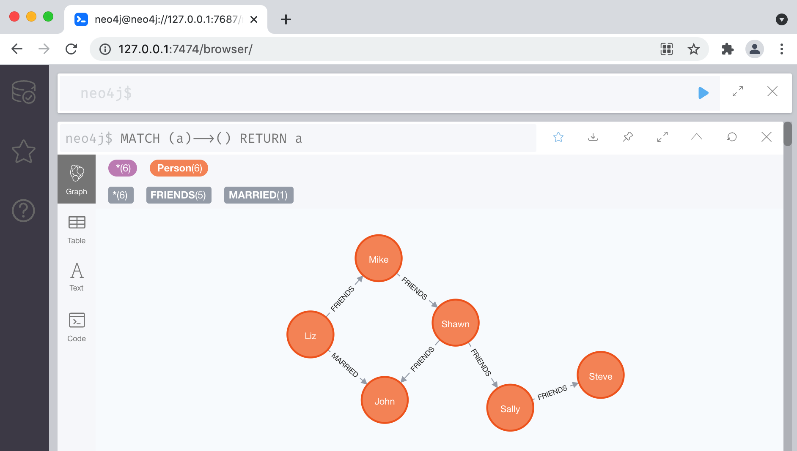
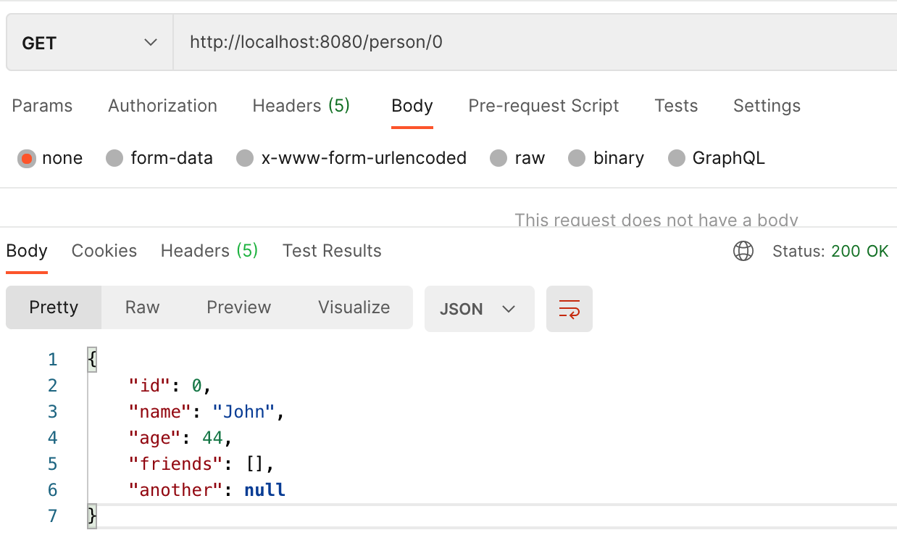
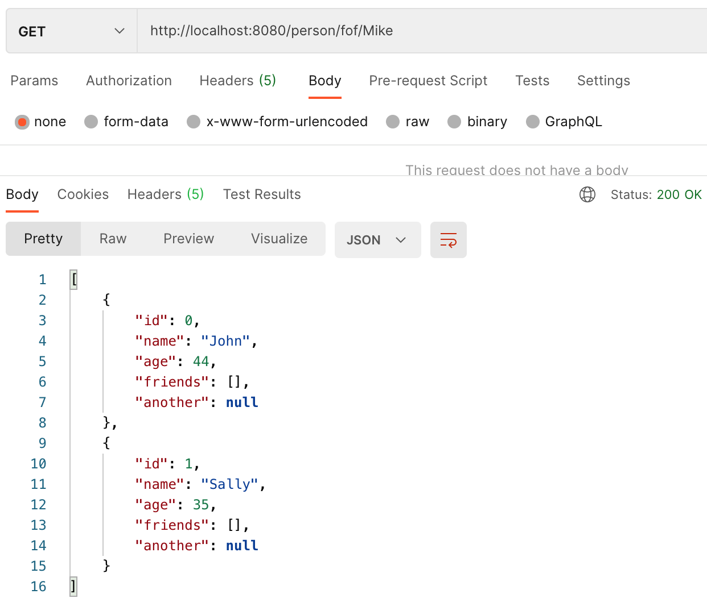
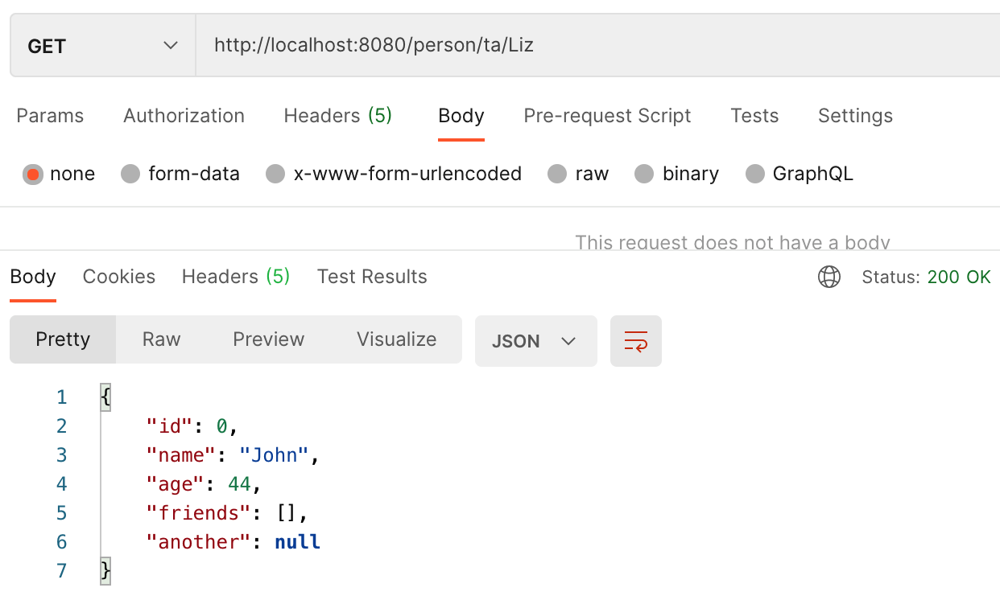

# Neo4jDemo
This is a demo project which integrate Neo4j with SpringBoot

Let's assume the neo4j database has below nodes and relationships:

In postman, you can test below APIs:
1. find person by id

2. find friend of friend

3. find couple
